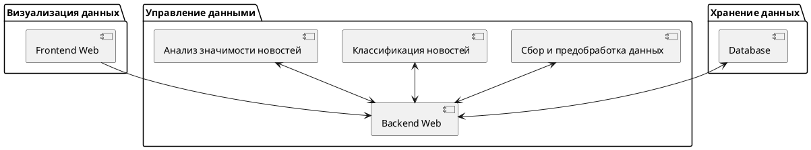
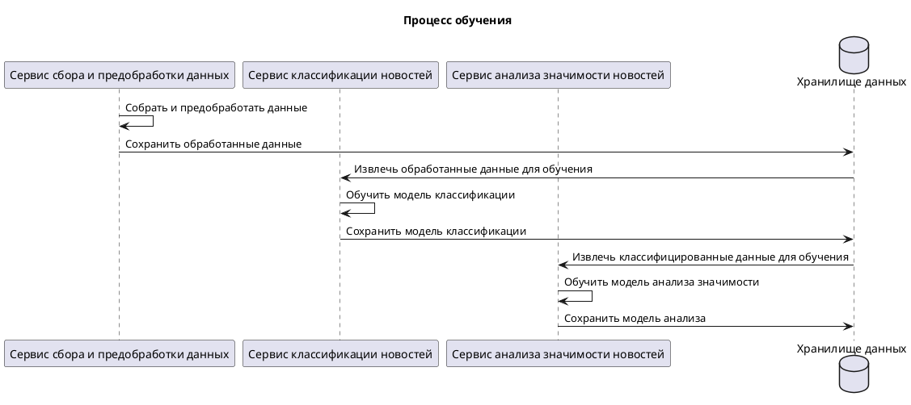
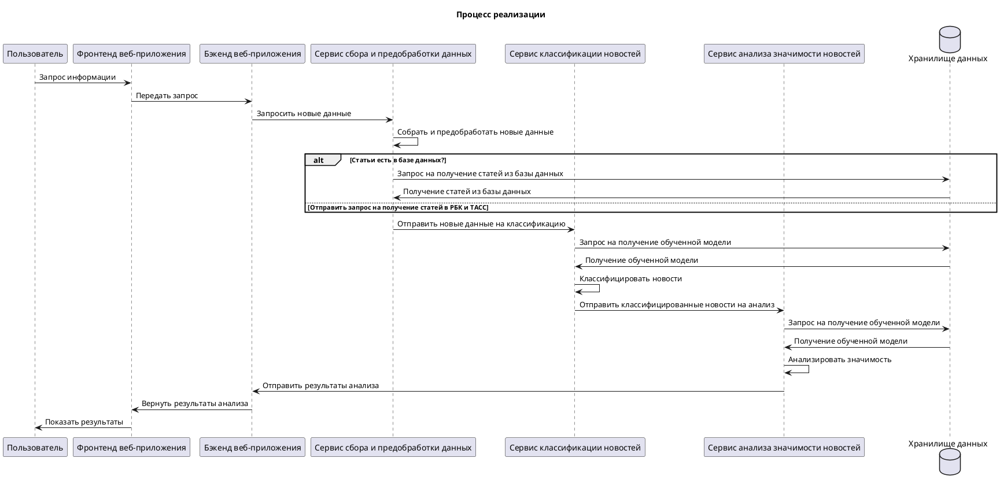

# Выявление значимых общественно-политических и экономических событий на курсовую стоимость валюты на основе семантического анализа

## Цели проекта:
- Исследование связи между общественно-политическими и экономическими событиями и колебаниями валютных курсов с помощью методов машинного обучения.

## Архитектура проекта

### Визуализация данных
- **Frontend Web**: пользовательский интерфейс, разработанный для визуализации результатов анализа и взаимодействия с пользователем. Позволяет пользователям запрашивать анализ определенных событий, просматривать исторические данные и получать инсайты о влиянии общественно-политических и экономических новостей на курсы валют.

### Управление данными
- **Backend Web**: серверная часть, обеспечивающая логику приложения, включая обработку запросов от клиентской части, управление сессиями и аутентификацию.
- **Сбор и предобработка данных**: модуль отвечает за сбор данных из различных источников, их очистку и подготовку к анализу. Это могут быть новостные ленты, официальные экономические отчеты, данные социальных сетей и другие.
- **Классификация новостей**: компонент, использующий методы машинного обучения и NLP (обработка естественного языка) для определения релевантности и классификации собранных данных на основе их содержания.
- **Анализ значимости новостей**: этот модуль анализирует классифицированные новости, определяя их потенциальное влияние на валютные курсы, используя сложные алгоритмы и модели предсказаний.

### Хранение данных
- **Database**: централизованное хранилище данных, в котором сохраняются все собранные и обработанные данные, включая исторические данные о валютных курсах, новости и результаты анализа. Может использовать реляционную или нереляционную модель в зависимости от требований к производительности и структуре данных.

### Взаимодействие компонентов
- Все компоненты управления данными тесно интегрированы с Backend Web, что обеспечивает единый поток данных и упрощает обработку запросов.
- Frontend Web взаимодействует с Backend Web для отображения данных пользователю, отправки пользовательских запросов и получения результатов анализа.
- Database служит основой для хранения и извлечения всех необходимых данных, обеспечивая быстрый доступ и высокую надежность.

## Процессы проекта

1. **Процесс обучения нейросети:**

2. **Процесс применения:**

## Ожидаемый результат проекта:
В результате анализа, приложение может, указать, что резкое падение курса валюты было связано с политическим кризисом в стране или большим экономическим соглашением на международном уровне.

## Сложности проекта
- Временной лаг между новостью и изменением в курсе валюты
- Не все новости одинаковы важны для курса валют
- Многогранность экономики нельзя точно сказать из-за чего произошли колебания
- Настройка инфраструктуры